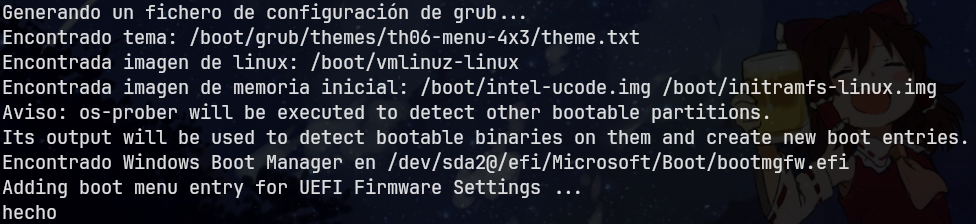

<h1 align="center">Touhou Grub Themes</h1>
<p align="center">README: <a href="/docs/README-ES.md">Español</a></p>

---
<h4 align="center">A collection of Touhou-style Grub themes</h4>

The contents are still in progress, so there will be more themes eventually. Any suggestions for adding/improving the contents would be appreciated :)

## Available themes
<table>
    <thead>
        <tr>
            <th scope="col">Theme</th>
            <th scope="col">4:3</th>
            <th scope="col">16:9</th>
        </tr>
    </thead>
    <tbody>
        <tr>
            <th scope="row"><strong>Touhou 6 Menu</strong></th>
            <td align="center"></td>
            <td align="center"></td>
        </tr> 
    </tbody>
</table>

## Resolutions

All the available themes were tested using [`grub2-theme-preview`](https://github.com/hartwork/grub2-theme-preview) with the following resolutions:

- <b>4:3 aspect ratio:</b>
    - 800 x 600
    - 1024 x 768
    - 1280 x 960 
    - 1440 x 1080 [HD]
    - 1600 x 1200 [HD]
- <b>16:9 aspect ratio:</b>
    - 1024 x 576
    - 1280 x 720
    - 1600 x 900 [HD]
    - 1920 x 1080 [HD]
    - 2560 x 1440 [HD-2]

## Installation

You can use the `install.sh` script to install the theme you want. It will show a list with all the available themes and their respective resolutions considering the ones indicated above. Each option has the format `Name [AspectRatio Quality]` (with Quality being optional), e.g. `Touhou 6 Menu [16:9 HD]`. This means that you have to choose based on the aspect ratio and quality, not a specific resolution (with the exception of the HD-2 quality group that has only 1 resolution lol). So basically you have to select the option that best adapts (that is closer to) your case.

Clone the repo and run the script as root:

```
sudo bash ./install.sh
```
> [!IMPORTANT]
> Please read the following section before choosing a theme or resolution.

## Notes & tips

- The resolutions presented above DO NOT correspond necessarily to the monitor screen resolution. Essentially, Grub displays according to your machine capabilities. To know what resolutions are allowed on your machine, you can enter `videoinfo` in the Grub console (press `c` to access the console while you are in the Grub menu). A list will be presented with all the admitted resolutions, and the currently set resolution will have an `*` next to it.
    
    Ideally, the set resolution is the same as your monitor screen; but if that's not the case and want to change it, you can modify the `GRUB_GFXMODE` variable within your `/etc/default/grub` file. E.g. `GRUB_GFXMODE=1024x768x32`. Keep in mind that, as stated before, you can set only one of the resolutions indicated by `videoinfo`. In case you set some resolution that's not listed, Grub will set it automatically (from what I've seen, it chooses the lowest one).

> [!IMPORTANT]
> After making any changes to the `/etc/default/grub` file, you have to update your Grub config to make them work by running `sudo grub-mkconfig -o /boot/grub/grub.cfg`, or `sudo update-grub` on Debian-based distros, or `sudo grub2-mkconfig -o /boot/grub2/grub.cfg` on Red Hat-based distros.

- Anytime you update your Grub config, the console output lists what entries were added to the Grub menu. Something like this:

    <div align="center"></div> 

    But if you see something like this:

    <div align="center"></div> 

    You will get your Grub menu polluted with a bunch of entries that aren't even bootable. To fix this, you can add `GRUB_DISABLE_BOOTNEXT=true` to your `/etc/default/grub` file.

    <!-- TODO: verify os_prober variable, grub_terminal variable and uefi advanced settings-->

## Backgrounds sources

- [Touhou 6 Menu](https://www.steamgriddb.com/hero/692)
