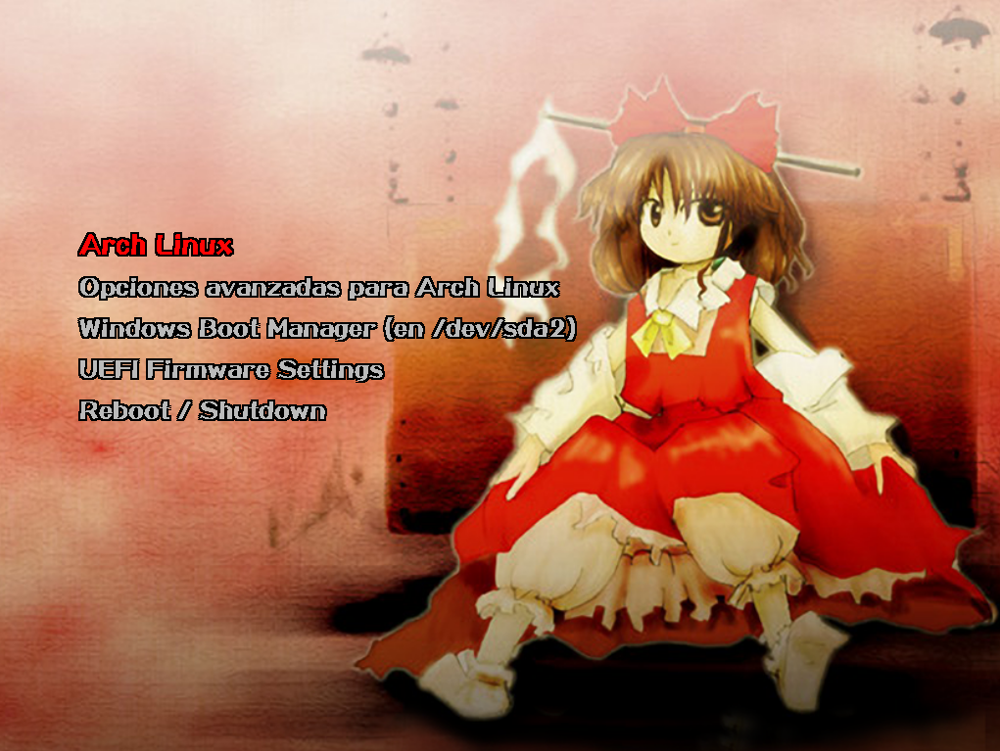
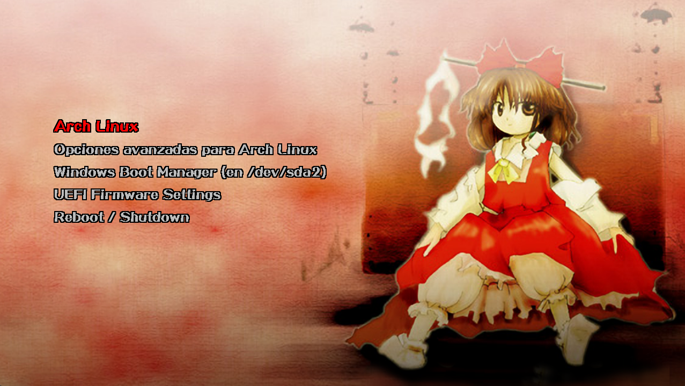
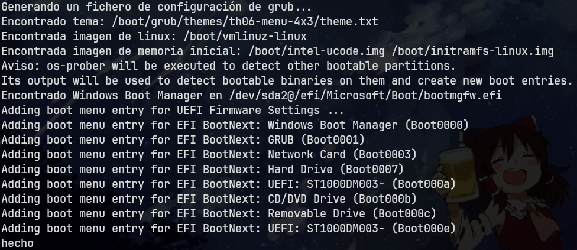

<h1 align="center">Touhou Grub Themes</h1>

<h4 align="center">Una colección de temas estilizados de Touhou</h4>

Los contenidos todavía están en progreso, así que habrán más temas eventualmente. Cualquier sugerencia para añadir/mejorar los contenidos es muy bienvenida :)

## Temas disponibles
<table>
    <thead>
        <tr>
            <th scope="col">Tema</th>
            <th scope="col">4:3</th>
            <th scope="col">16:9</th>
        </tr>
    </thead>
    <tbody>
        <tr>
            <th scope="row" style="vertical-align: middle;"><strong>Touhou 6 Menu</strong></th>
            <td align="center"></td>
            <td align="center"></td>
        </tr> 
    </tbody>
</table>

## Resoluciones

Todos los temas disponibles fueron testeados usando [`grub2-theme-preview`](https://github.com/hartwork/grub2-theme-preview) con las siguientes resoluciones:

- <b>Relación de aspecto 4:3:</b>
    - 800 x 600
    - 1024 x 768
    - 1280 x 960 
    - 1440 x 1080 [HD]
    - 1600 x 1200 [HD]
- <b>Relación de aspecto 16:9:</b>
    - 1024 x 576
    - 1280 x 720
    - 1600 x 900 [HD]
    - 1920 x 1080 [HD]
    - 2560 x 1440 [HD-2]

## Instalación

Puedes usar el script `install.sh` para instalar el tema que quieras. Se mostrará una lista con todos los temas disponibles y sus resoluciones respectivas, considerando las que se indican arriba. Cada opción tiene el formato `Nombre [RelacionAspecto Calidad]` (con Calidad siendo opcional), e.j. `Touhou 6 Menu [16:9 HD]`. Esto significa que tienes que escoger basándote en la relación de aspecto y la calidad, mas no en una resolución específica (con la excepción del grupo de la calidad HD-2, que solo tiene 1 resolución). Básicamente, tienes que seleccionar la opción que mejor se adapte (que más se acerque) a tu caso.

Clona el repo y ejecuta el script como root:

```
sudo bash ./install.sh
```
> [!IMPORTANT]
> Por favor, lee la siguiente sección antes de escoger un tema o calidad.

## Notas y tips

- La resoluciones presentadas arriba NO corresponden necesariamente a la resolución de la pantalla del monitor. Esencialmente, Grub se muestra según las capacidades de tu equipo. Para conocer qué resoluciones se permiten en tu equipo, puedes ingresar `videoinfo` en la consola de Grub (presiona `c` para acceder a la consola mientras estás en el menú de Grub). Se presentará una lista con todas las resoluciones admitidas, y la resolución establecida actualmente tendrá un `*` al lado.
    
    Idealmente, la resolución establecida será la misma que la pantalla de tu monitor; pero si ese no es el caso y quieres cambiarla, puedes modificar la variable `GRUB_GFXMODE` dentro de tu archivo `/etc/default/grub`. E.j. `GRUB_GFXMODE=1024x768x32`. Ten en cuenta que, como se dijo anteriormente, puedes establecer solo una de las resoluciones indicadas por `videoinfo`. En caso de que pongas alguna resolución que no esté listada, Grub la establecerá automáticamente (de lo que he visto, escoge la más baja).

> [!IMPORTANT]
> Después de hacer cualquier cambio al archivo `/etc/default/grub`, tienes que actualizar tu configuración de Grub para que haga efecto, ejecutando `sudo grub-mkconfig -o /boot/grub/grub.cfg`, o `sudo update-grub` en distros basadas en Debian, o `sudo grub2-mkconfig -o /boot/grub2/grub.cfg` en distros basadas en Red Hat.

- Cada vez que actualices tu configuración de Grub, la salida en consola lista las entradas que fueron añadidas al menú de Grub. Algo así:

    <div align="center"></div> 

    Pero si ves algo como esto:

    <div align="center"></div> 

    Tu menú de Grub se llenará de un montón de entradas EFI innecesarias. Para arreglar esto, puedes añadir `GRUB_DISABLE_BOOTNEXT=true` en tu archivo `/etc/default/grub`.

- Si tienes un monitor de relación de aspecto 16:9 pero tu equipo solo permite resoluciones de 4:3, puedes establecerlas sin problemas. Al arrancar el menú, tal vez se muestre manteniendo la relación de aspecto de 16:9 del monitor, y está bien si no tienes problema con eso; pero en el caso de que quieras que se muestre manteniendo la resolución de 4:3, podrías revisar las configuraciones de tu monitor. Quizás haya algún ajuste de tamaño de imagen que esté definido como "amplio" en lugar de auto o por defecto, haciendo que tu monitor se muestre siempre con su resolución máxima.

## Fuentes de las imágenes

- [Touhou 6 Menu](https://www.steamgriddb.com/hero/692)
